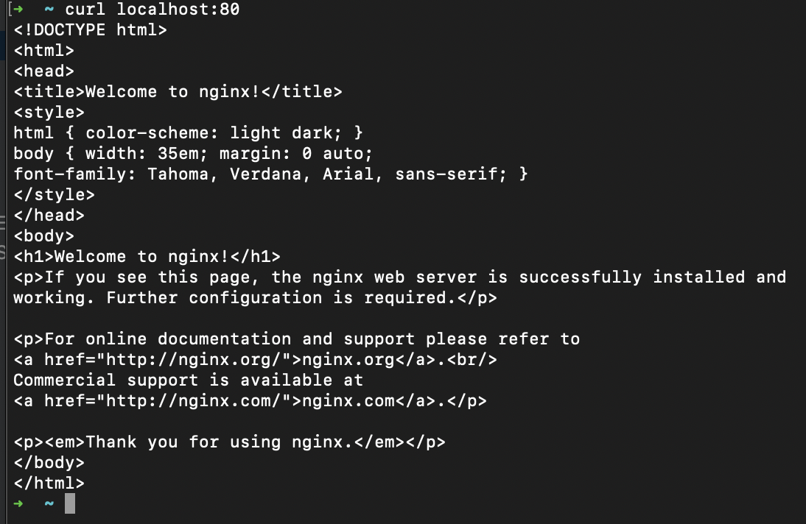
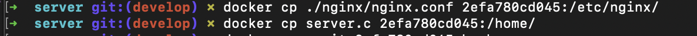

## Part 1. Готовый докер

1.1 Использование команды docker pull для выкачки докера nginx

1.2 Проверка наличия докер образа при помощи команды docker images

1.3 Запуск докер образа при помощи команды docker run -d image_id

1.4 Проверка запуска докера при помощи команды docker ps

1.5 Просмотр информации о контейнере при помощи команды docker inspect container_id

1.6 Остановка докер образа и проверка, что он остановился

1.7 Запуск докера с замапленными портами 80 и 443

1.8 Проверка на доступность стартовой страницы nginx по адресу localhost:80 в браузере

1.9 Перезапуск докера и проверка, что он запустился

## Part 2. Операции с контейнером

2.1 Вывод содрежимого файла nginx.conf

2.2 Создание на локальной машине файла nginx.conf. Настройка в нем по пути /status отдачу страницы статуса сервера

2.3 Копирование файла nginx.conf внутрь докер образа. Перезапуск nginx внутри докер рбраза. Проверка статуса сервера

2.4 Экспорт контейнера в файл. Остановка контейнера

2.5 Удаление образа

2.6 Удаление остановленного контейнера

2.7 Импорт контейнера обратно. Запуск импортированного контейнера. Проверка работоспособности контейнера

## Part 3. Мини веб-сервер

3.1 Создание сервера на языке С

3.2 Создание nginx.conf

3.3 Выкачка докера nginx. Проверка, что загрузка прошла успешно. Запуск образа и проверка, что он запустился

3.4 Копирование nginx.conf и server.c в докер-контейнер

3.5 Вход в сам контейнер. Проверка, что файлы успешно скопировались

3.6 Обновление контейнера. Установка gcc, spawn-dcgi, libfcgi-dev

3.7 Компиляция и запуск нашего сервера
     
3.8 Перезагрузка контейнера и проверка страницы в браузере

## Part 4. Свой докер

4.1 Создание докер образа.

4.2 Запуск скрипта из докера                                                  

4.3 Сбор написанного образа. Маппинг 81 порта на 80. Проверка доступа стрички командной localhost:80                              

4.4 Проверка на корректность сборки                                           

4.5 Добавление в файл nginx.conf проксирование странички /status                                        

4.6 Проверка странички /status                                     

## Part 5. **Dockle**

5.1 Сканирование образа                                  

5.2 Проверка на отсутствие ошибок и предупреждений после исправления образа                    

## Part 6. Базовый **Docker Compose**

6.1 Файл docker-compose.yml                  

6.2 Проверка на работоспособность после сборки и запуска                

